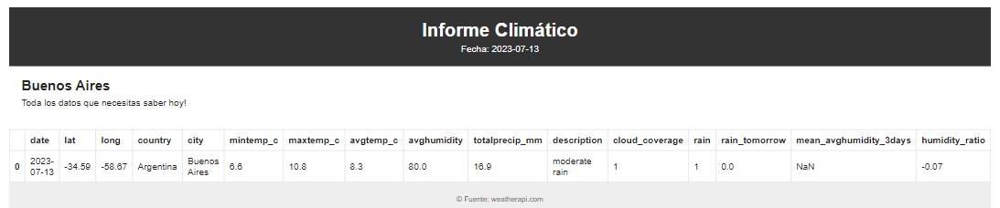

# etl_airflow/ dag_weather
Este DAG (Grafo Acíclico Dirigido) está diseñado para obtener los datos del pronóstico del tiempo para Buenos Aires, Argentina, y realizar varias tareas con los datos.
Realiza en llamadas a **http://api.weatherapi.com** para traer pronósticos climáticos en la provincia de Buenos aires dado un rango de días.

## Descripción:
El DAG obtiene los datos del pronóstico del tiempo para un día específico, transforma los datos, los carga en una base de datos Redshift y envía un correo electrónico con la información del clima procesada.

## Configuración del DAG
* ID del DAG: dag_weather
* Propietario: MariaRO
* Fecha de inicio: 19 de junio de 2023
* Intervalo de programación: Una vez al día a las 6:00 AM
* Reintentos: 5
* Retardo entre reintentos: 5 minutos
* Catchup: False (no se ejecutan tareas antiguas)

## Orden de ejecución
Las tareas están configuradas para ejecutarse en un orden específico:

**extract_data >> transform_data >> upload_data >> send_email**

## Ejemplo Emailing
